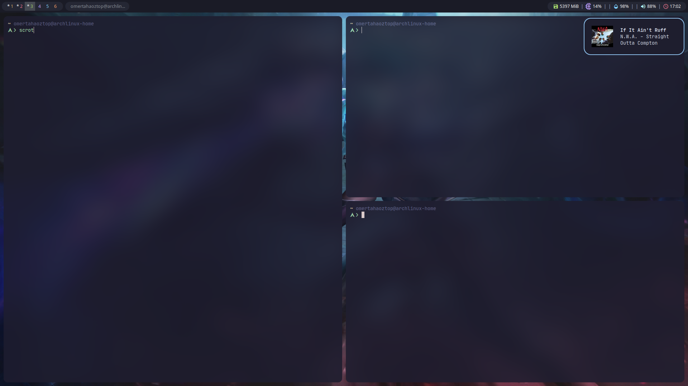

# Arch Linux Kurulum Sonrası

Bu Blog yazımda geliştirme ortamımı nasıl sıfırdan kuracağımı anlatacağım.

# Github Reposu
Sıfırdan kurulum için git repoma ihtiyacım var;
[Repom](https://github.com/omertahaoztop/MyDotfiles)

## Kurulum Aşaması

Repoda sıfırdan kurulum için iki dosyaya ihtiyacım var;
- [ packages.sh](https://raw.githubusercontent.com/omertahaoztop/MyDotfiles/main/packages.sh)
- [bspwm.sh](https://raw.githubusercontent.com/omertahaoztop/MyDotfiles/main/bspwm.sh)

## Scriptlerin Açıklaması
- [bspwm.sh](https://raw.githubusercontent.com/omertahaoztop/MyDotfiles/main/bspwm.sh) Scripti BSPWM için gerekli paketleri ve bağımlılıkları kurup konfigürasyon dosyalarımı içeren klasörleri yeni kurulum yapılacak bilgisayarda ilgili yerlere kaydediyor.
- [ packages.sh](https://raw.githubusercontent.com/omertahaoztop/MyDotfiles/main/packages.sh)  Scripti ise genellikle Linux ortamımda kullandığım paketleri içeriyor.

## Scriptlerin Çalıştırılması;
<code class="shell">
bash bspwm.sh
</code>
 
<code class="shell">
bash packages.sh
</code>

### Ekran Görüntüsü

