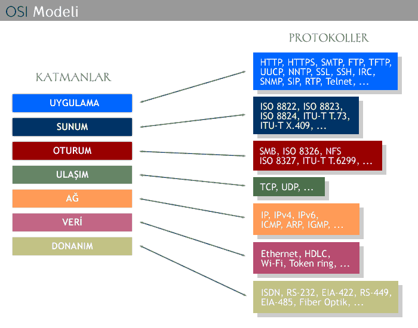

# Yazı Hakkında
Bu seriyi yazmaktaki en büyük hedefim, Linux Sistemleriyle ilgili olan veya bu işlerde çalışan benim gibi insanların en önemsemediği aslında en önemli konulardan biri olan <b>Network(Bilgisayar Ağları)</b> nı iyi öğrenerek ihtiyaç duyulduğunda erişilebilir olması.
### Ağ Nedir
- Bir Ağ'ın mantığı belirli şeyleri paylaşmaktır. (Uygulama,yazıcı,depolama,yedekleme vb.)
### Bir Ağı Oluşturan Fiziksel Bileşenler
- Router
- Switch
- Firewall
- Access-Point
- İstemci
### OSI Referans Modeli
- 7 Katmandan oluşan Açık Standart Model
- Internette kullanılacak protokol.



#### Uygulama Katmanı:
- Kullanıcılara bir arayüz sağlar.
- Web sayfasına erişimi sağlayan protokol.

#### Sunum Katmanı:
- Veriyi belirli bir formata sokarak uygulama katmanına iletir.

#### Oturum Katmanı:
- Gönderen ve alan bilgisayarları arasında oturumlar kuruyor ve bunları yönetiyor.

#### Taşıma Katmanı:
- Gönderen ve alan bilgisayar arasında veri vb. araçların transferinden sorumlu.

#### Ağ Katmanı:
- Cihazlara IP tanımlanması, verinin iletilmesi için en iyi yolun belirlenmesi. Farklı networkler arası iletişimin sağlanması.

#### Veri Katmanı:
- Verilerin cihazlar arasında fiziksel olarak aktarımını sağlar.

#### Donanım Katmanı:
- Gönderen ve alan bilgisayar arasındaki cihazların kablolu/kablosuz olarak bağlantısını sağlayan parçalar.


### TCP/IP Protokol Kümesi
OSI Katmanından farklı olarak 4 katmandan oluşmaktadır Bunlar;
1. Application(Uygulama)
2. Transport(Taşıma)
3. Internet
4. Network Access (Ağ Erişimi)

-----
Temelde ağlar LAN(Local Area Network) ve WAN(Wide Area Network) olmak üzere ikiye ayrılır.
## LAN Nedir?
- Sınırlı bir alandaki birbirlerine bağlı cihazlar ve belirli bir ortama erişim sağlayan ağ yapısı.

### LAN Bileşenleri
- Switchler:
    - Switchler en basit anlamda iki cihazı birbirine bağlamak için kullanılır.


### Ethernet Nedir?
- LAN'da bulunan cihazların birbirleriyle haberleşmesi için kullanılan protokol.
- Ethernet OSI Katmanının 1.ve 2. katmanlarında çalışır.

#### MAC Adresi
- Kaynak ve hedef cihazları tanımlayan benzersiz bir adres. Cihazı tanımlayan adres olarakta tanımlanabilir.
- 48 bitten oluşur.
- Bir cihazın MAC adresi ile başka bir cihazın MAC adresi birbirinden farklıdır.
- Aynı anda bulunan cihazlar birbirleriyle iletişim için MAC adreslerini kullanır.

#### Linux'ta MAC adreslerini öğrenme;
```cat /sys/class/net/*/address```
